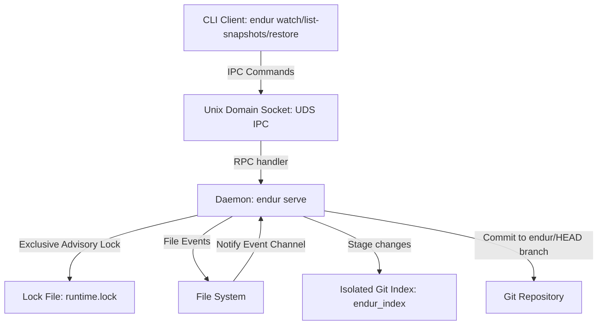

# Endur Developer Guide

This document explains the internal architecture, design patterns, and code structure of `endur`. It is intended for developers who wish to modify, debug, or extend the codebase.

---

## System Architecture

The following diagram illustrates the relationship between the CLI client, the background Daemon, the filesystem, and the Git repository:



---

## Core Components

### 1. Command-Line Interface ([src/main.rs](file:///Users/pjc/Development/endur/src/main.rs))
*   **Subcommand Routing**: Parses arguments using `clap` and routes them.
*   **Daemon Notification**: Subcommands like `watch` and `unwatch` perform the local configuration changes and notify the running daemon using the `poller::send_uds_command` helper.
*   **Direct Command execution**: Core recovery tasks like `list-snapshots` and `restore` execute directly in the client context by parsing the Git repository, avoiding UDS overhead.

### 2. Runtime Locking & Single Instance enforcement ([src/database.rs](file:///Users/pjc/Development/endur/src/database.rs))
*   **`RuntimeLock` struct**: Enforces that only one daemon instance is active.
*   **Exclusive Advisory Locking**: Utilizes `fs2::FileExt::try_lock_exclusive` to acquire an OS-level lock on the file `~/.cache/endur/runtime.lock` (and database at `runtime.db`).
*   **Auto-Cleanup**: The lock is automatically released by the operating system when the daemon process terminates.

### 3. Client-Server IPC ([src/poller.rs](file:///Users/pjc/Development/endur/src/poller.rs))
*   **Unix Domain Sockets**: The daemon binds to local sockets using `tokio::net::UnixListener` on both Unix and Windows 10/11 (where UDS is natively supported):
    *   *macOS/Linux*: `~/.cache/endur/endur.sock`
    *   *Windows*: `%AppData%\Local\endur\endur.sock`
*   **JSON-RPC Protocol**: Communication uses simple JSON payloads:
    *   `reload`: Reloads configuration when watched repositories change.
    *   `kill`: Triggers a graceful shutdown of the daemon.
    *   `status`: Responds with daemon metrics.

### 4. File Watcher & Filter Engine ([src/watcher.rs](file:///Users/pjc/Development/endur/src/watcher.rs))
*   **`WatcherManager` struct**: Manages recursive file system monitoring using the `notify` crate.
*   **Path Canonicalization**: Filesystem events on macOS and Linux often report relative paths or symlink roots (like `/var` vs `/private/var`). The watcher canonicalizes all event paths prior to comparison.
*   **Git-Aware Filtering**:
    *   Excludes `.git/` folder and its contents automatically.
    *   Loads `.gitignore` files using `ignore::gitignore::Gitignore` to match change events against gitignore rules and discard ignored files.

### 5. Daemon Control Loop ([src/poller.rs](file:///Users/pjc/Development/endur/src/poller.rs))
*   **Event Await & Debounce**: The daemon loop listens to four event sources using `tokio::select!`:
    *   *OS Signal Handler Channel*: Listens to target-specific shutdown signals pinned to the stack (`wait_for_signal()`). On Unix, handles `SIGINT`, `SIGTERM`, and `SIGHUP`. On Windows, handles `Ctrl+C` and `Ctrl+Break` events.
    *   *IPC Command Channel*: Process socket operations.
    *   *File Watcher Channel*: Pushes modified files. Captured file changes are cached in a hash map with a 500ms delay.
    *   *Timer Channel*: Triggers a capture operation for repositories that have modifications older than 500ms.
*   **Graceful Exit Actions**: When a shutdown signal is received, the loop sends a broadcast termination signal to UDS socket handlers, clears the `RuntimeLock` PID metadata value back to `None`, and exits cleanly.
*   **Optimization**: Debouncing prevents multiple rapid writes (e.g., compilation artifacts or quick editor saves) from creating dozens of intermediate commits.

### 6. Isolated Snapshot Capture ([src/snapshots.rs](file:///Users/pjc/Development/endur/src/snapshots.rs))
*   **`snapshots::capture`**: Stages changes and commits them.
*   **Git Index Isolation**: Rather than using the user's primary Git index (`.git/index`), it creates and maintains a dedicated staging index file at `.git/endur_index` via `git2::Index::open`.
*   **Branch Architecture**:
    *   Backups are committed to local branches named `endur/<base-commit-hash>`.
    *   The parent of the first endur snapshot is the user's HEAD commit. Subsequent backups chain off the previous endur backup commit, keeping histories completely linear.

### 7. Interactive TUI Restore & Control Center ([src/tui.rs](file:///Users/pjc/Development/endur/src/tui.rs))
*   **Decoupled `TuiState`**: Separates core snapshot-browsing state management (watched repositories, snapshots, modified file listings, checkmarked files, and pane focusing) from the rendering engine. This allows the backup-browsing screen and its logic to be seamlessly reused inside both the single-purpose `endur restore -i` utility and the multi-tab Control Center.
*   **Asynchronous Control Center TUI (`endur tui`)**:
    *   **Tokio Event Loop**: Uses an async main loop running on Tokio to merge multiple non-blocking event sources: Crossterm keyboard events, periodic daemon PID/uptime status checks, and log file tail changes.
    *   **Live Log Streaming**: Spawns an asynchronous log tail watcher that tails changes to `endur.log` and feeds new lines directly into the state machine to trigger real-time UI updates.
    *   **Multi-Tab Architecture**: Tracks the active view using a `ControlCenterTab` enum (tabs: `Repositories`, `Backups`, `Log`, `Metrics`).
*   **Safe Terminal RAII**: An RAII wrapper `TerminalGuard` manages terminal raw mode, alternate screen buffers, and cursor visibility, ensuring the shell is always cleanly restored on program exit or panic.

### 8. Background Service Management ([src/service.rs](file:///Users/pjc/Development/endur/src/service.rs))
*   **macOS (`launchctl` Integration)**: Creates `~/Library/LaunchAgents/com.endur.daemon.plist` configured to run `endur serve` in the background, and registers it using the modern `launchctl bootstrap` framework (falling back to `launchctl load` if necessary).
*   **Linux (`systemd` Integration)**: Configures a systemd user unit at `~/.config/systemd/user/endur.service` and executes systemd commands to daemon-reload, enable, and start/stop the service.

---

## Development & Testing Workflow

### Compiling
```bash
cargo build
```

### Running Tests
The test suite consists of several test suites covering locking, IPC, watcher, and snapshotting:
```bash
cargo test
```

### Key Integration Tests
*   [tests/startup_test.rs](file:///Users/pjc/Development/endur/tests/startup_test.rs): Tests UDS communication (now verified on both Unix and Windows), OS signal graceful shutdown, invalid lock files, and double-lock prevention.
*   [tests/watch_test.rs](file:///Users/pjc/Development/endur/tests/watch_test.rs): Tests watcher registration and event-driven backup snapshots.
*   [tests/snapshots_test.rs](file:///Users/pjc/Development/endur/tests/snapshots_test.rs): Tests Git index isolation, git ignore support, listing snapshots, and restoring snapshots.
*   [tests/poll_guard_test.rs](file:///Users/pjc/Development/endur/tests/poll_guard_test.rs): Tests poller lock mechanics and state changes.
